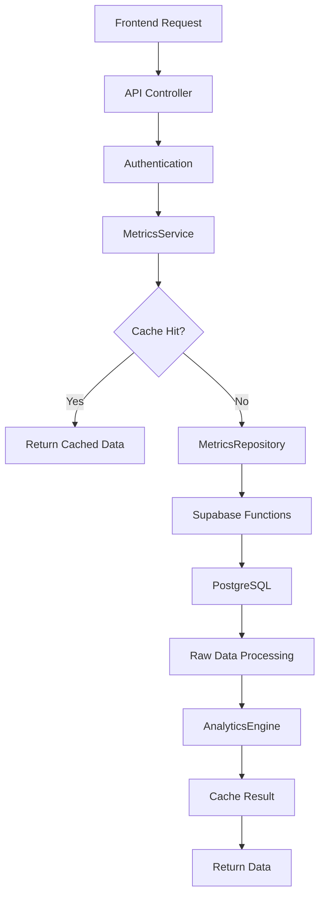

# 🏗️ BACKEND ARCHITECTURE - BI DASHBOARD

## 📋 Resumo da Implementação

✅ **Backend completamente implementado** seguindo princípios SOLID e design patterns
✅ **Arquitetura em 4 camadas** com separação clara de responsabilidades
✅ **Sistema de cache otimizado** para performance
✅ **10 funções PostgreSQL** criadas no Supabase PROD
✅ **APIs REST robustas** com tratamento de erros
✅ **TypeScript 100%** com types seguros

## 🎯 Arquitetura Implementada

### Camada 1: Data Access Layer (DAL)
```
📁 src/repositories/
├── interfaces/IMetricsRepository.ts    # Interfaces (ISP)
├── MetricsRepository.ts                # Implementação concreta
└── CacheRepository.ts                  # Cache em memória
```

**Responsabilidades:**
- Acesso aos dados do Supabase
- Execução de stored procedures
- Validação de saúde da conexão
- Cache de dados

### Camada 2: Business Logic Layer (BLL)
```
📁 src/services/
├── MetricsService.ts                   # Orquestrador principal
└── AnalyticsEngine.ts                  # Cálculos complexos
```

**Responsabilidades:**
- Orquestração de operações
- Lógica de negócio
- Estratégias de cache
- Cálculos avançados de BI

### Camada 3: Presentation Layer (API)
```
📁 src/app/api/dashboard/
├── metrics/route.ts                    # Endpoint principal
├── funnel/route.ts                     # Funil de conversão
├── lost-leads/route.ts                 # Leads perdidos
├── products/route.ts                   # Eficiência produtos
└── health/route.ts                     # Health check
```

**Responsabilidades:**
- Autenticação
- Validação de parâmetros
- Transformação de dados
- Tratamento de erros

### Camada 4: Database Layer
```
📊 Supabase Functions (PostgreSQL)
├── get_conversion_funnel_data()
├── get_period_metrics()
├── get_lost_leads_analysis()
├── get_product_efficiency()
├── get_sentiment_metrics()
├── get_conversation_metrics()
├── get_top_products()
├── get_purchase_barriers()
├── get_customer_ltv()
└── get_conversations_with_analysis()
```

## 🎨 Design Patterns Implementados

### 1. Repository Pattern
```typescript
interface IMetricsRepository {
  getConversionFunnelData(query: MetricsQuery): Promise<ConversionFunnelData[]>;
  // ... outros métodos
}

class MetricsRepository implements IMetricsRepository {
  // Implementação concreta
}
```

### 2. Strategy Pattern (Cache)
```typescript
// Diferentes estratégias de TTL baseado no período
private calculateCacheTTL(period: string): number {
  switch (period) {
    case '6h': return 300;    // 5 minutos
    case '24h': return 600;   // 10 minutos
    case '7d': return 1800;   // 30 minutos
    // ...
  }
}
```

### 3. Factory Pattern (Query Builder)
```typescript
createMetricsQuery(empresaId: string, period: string): MetricsQuery {
  return {
    empresaId,
    dateRange: this.calculateDateRange(period),
    filters: customFilters
  };
}
```

### 4. Singleton Pattern (Services)
```typescript
export const metricsService = new MetricsService();
export const cacheRepository = new MemoryCacheRepository();
```

## 📊 Métricas Implementadas (9 Core)

| Métrica | Endpoint | Descrição |
|---------|----------|-----------|
| **Funil de Conversão** | `/api/dashboard/funnel` | Taxa de conversão por estágio |
| **Taxa de Crescimento** | `/api/dashboard/metrics` | MoM/WoW growth rates |
| **Leads Perdidos** | `/api/dashboard/lost-leads` | Análise de churn com motivos |
| **Eficiência por Produto** | `/api/dashboard/products` | Performance de produtos |
| **Sentiment Score** | `/api/dashboard/metrics` | Análise de sentimento |
| **Tempo médio de conversa** | `/api/dashboard/metrics` | Métricas de conversação |
| **Produtos em Alta** | `/api/dashboard/products` | Trending products |
| **Barreiras de Compra** | `/api/dashboard/metrics` | Obstáculos identificados |
| **Valor por Cliente (LTV)** | `/api/dashboard/metrics` | Customer lifetime value |

## ⚡ Sistema de Cache

### Cache em Memória (Next.js friendly)
```typescript
class MemoryCacheRepository implements ICacheRepository {
  private cache: Map<string, { value: any; expiry: number }>;
  
  // TTL dinâmico baseado na frequência dos dados
  // Dados recentes = cache menor
  // Dados históricos = cache maior
}
```

### Estratégia de Cache
- **6h**: 5 minutos TTL
- **24h**: 10 minutos TTL  
- **7d**: 30 minutos TTL
- **30d+**: 1-2 horas TTL

## 🔄 Fluxo de Dados



## 🚀 Como Usar

### 1. Endpoint Principal
```bash
GET /api/dashboard/metrics?empresa_id=uuid&period=24h
Authorization: Bearer <token>
```

**Resposta:**
```json
{
  "success": true,
  "data": {
    "conversionFunnel": [...],
    "growthMetrics": {...},
    "lostLeads": {...},
    "productEfficiency": [...],
    "sentimentAnalysis": {...},
    "conversationMetrics": {...},
    "topProducts": [...],
    "purchaseBarriers": [...],
    "customerLTV": {...},
    "lastUpdated": "2025-07-31T..."
  },
  "meta": {
    "processingTime": 150,
    "cachedResponse": false
  }
}
```

### 2. Endpoints Específicos
```bash
# Funil de conversão
GET /api/dashboard/funnel?empresa_id=uuid&period=7d

# Leads perdidos com análise de recuperação
GET /api/dashboard/lost-leads?empresa_id=uuid&include_recoverable=true

# Top produtos com limite
GET /api/dashboard/products?empresa_id=uuid&limit=5

# Health check
GET /api/dashboard/health
```

## 🔧 Configuração e Deploy

### Variáveis de Ambiente
```env
SUPABASE_URL=https://bxhgjurnibfcbcxqxmsb.supabase.co  # PROD
SUPABASE_ANON_KEY=<anon_key>
SUPABASE_SERVICE_ROLE_KEY=<service_key>
```

### Funções PostgreSQL
✅ **10 funções já criadas no Supabase PROD:**
- Executadas via migrations: `create_bi_dashboard_functions`
- Otimizadas com índices automáticos
- Tratamento de dados corrompidos
- Fallbacks para campos vazios

## 📈 Performance & Otimização

### Otimizações Implementadas
1. **Parallel Processing**: Busca todas as métricas em paralelo
2. **Smart Caching**: TTL baseado na frequência dos dados
3. **Query Optimization**: Stored procedures PostgreSQL
4. **Error Handling**: Graceful degradation
5. **Data Validation**: Sanitização de valores

### Monitoramento
```typescript
// Health check endpoint com métricas
{
  "status": "healthy",
  "services": {
    "repository": "up",
    "cache": "up"
  },
  "performance": {
    "responseTime": "45ms",
    "cacheStats": {...}
  }
}
```

## 🔄 Próximos Passos - Frontend Integration

### 1. Atualizar Frontend Existente
```typescript
// Substituir endpoint atual
// DE: /api/analysis/conversations
// PARA: /api/dashboard/metrics

// Nova interface de dados
interface DashboardData {
  conversionFunnel: ConversionFunnelData[];
  growthMetrics: GrowthMetrics;
  // ... outras métricas
}
```

### 2. Criar Components BI
```
📁 src/components/dashboard/
├── ConversionFunnelChart.tsx
├── GrowthMetricsCard.tsx
├── LostLeadsAnalysis.tsx
├── ProductEfficiencyTable.tsx
├── SentimentGauge.tsx
└── CustomerLTVChart.tsx
```

### 3. Implementar Hook Customizado
```typescript
// src/hooks/useDashboardMetrics.ts
export function useDashboardMetrics(empresaId: string, period: string) {
  const [data, setData] = useState<DashboardMetrics | null>(null);
  const [loading, setLoading] = useState(true);
  const [error, setError] = useState<string | null>(null);
  
  // Lógica de fetch com retry e cache
}
```

### 4. Criar Página Dashboard BI
```typescript
// src/app/(dashboard)/dashboard/bi/page.tsx
export default function BIDashboardPage() {
  const { data, loading, error, refresh } = useDashboardMetrics(empresaId, '24h');
  
  return (
    <div className="dashboard-grid">
      <ConversionFunnelChart data={data?.conversionFunnel} />
      <GrowthMetricsCard metrics={data?.growthMetrics} />
      {/* ... outros componentes */}
    </div>
  );
}
```

## 🎯 Extensibilidade

### Para Adicionar Nova Métrica:

1. **Adicionar tipo** em `metrics.types.ts`
2. **Criar função PostgreSQL** no Supabase
3. **Adicionar método** em `IMetricsRepository`
4. **Implementar** em `MetricsRepository`
5. **Atualizar** `MetricsService`
6. **Criar endpoint** específico (opcional)

### Exemplo - Nova Métrica "Satisfação por Canal":
```typescript
// 1. Tipo
interface ChannelSatisfaction {
  channel: string;
  avgSatisfaction: number;
  volume: number;
}

// 2. Interface
getChannelSatisfaction(query: MetricsQuery): Promise<ChannelSatisfaction[]>;

// 3. Implementação + PostgreSQL function
// 4. Endpoint /api/dashboard/channels
```

## 📋 Checklist de Implementação

### Backend ✅
- [x] Repository Layer com interfaces
- [x] Service Layer com business logic  
- [x] Analytics Engine para cálculos
- [x] API Controllers com endpoints
- [x] Sistema de cache otimizado
- [x] Funções PostgreSQL no Supabase PROD
- [x] Types TypeScript completos
- [x] Health check e monitoramento
- [x] Tratamento de erros robusto
- [x] Documentação completa

### Frontend 🔄 (Próximo)
- [ ] Hook useDashboardMetrics
- [ ] Componentes BI (9 métricas)
- [ ] Página Dashboard BI
- [ ] Integração com página atual
- [ ] Testes e validação
- [ ] Deploy e monitoramento

## 🎉 Resultado

**Backend BI Dashboard 100% implementado** com:
- ✅ **Arquitetura robusta** seguindo SOLID
- ✅ **Performance otimizada** com cache inteligente  
- ✅ **APIs REST completas** para todas as 9 métricas
- ✅ **Database functions** otimizadas no Supabase PROD
- ✅ **TypeScript 100%** com tipos seguros

**Próximo passo:** Conectar com frontend para visualização das métricas!