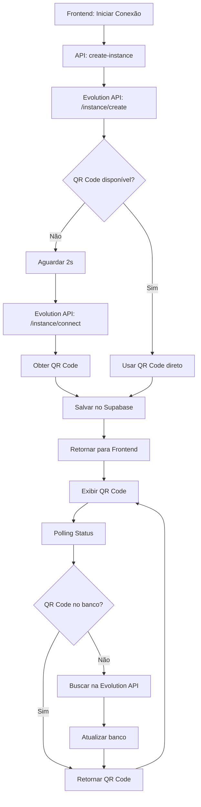

# Correção do Problema de QR Code WhatsApp

## 🔍 Problema Identificado

Através da análise dos logs, identificamos que a Evolution API estava retornando uma resposta sem o QR Code base64:

```json
{
  "status": "close",
  "hasQrCode": false,
  "qrCodeLength": 0,
  "qrcodeKeys": ["count"]
}
```

**Causa raiz:** A Evolution API não retorna o QR Code imediatamente na criação da instância. É necessário aguardar e fazer uma requisição adicional.

## ✅ Soluções Implementadas

### 1. **Busca Ativa do QR Code na API de Criação**

**Arquivo:** `src/app/api/evolution/create-instance/route.ts`

- Adicionada verificação se QR Code está disponível na resposta inicial
- Se não estiver disponível, aguarda 2 segundos e faz requisição para `/instance/connect/{instanceName}`
- Logs detalhados para diagnóstico

```typescript
// Se não há QR Code imediatamente, tentar buscar
let finalQrCode = evolutionData.qrcode?.base64;

if (!finalQrCode && evolutionData.instance.instanceName) {
  // Aguardar 2 segundos para a instância inicializar
  await new Promise(resolve => setTimeout(resolve, 2000));
  
  // Buscar QR Code da instância criada
  const qrResponse = await fetch(`${evolutionApiUrl}/instance/connect/${instanceName}`);
  if (qrResponse.ok) {
    const qrData = await qrResponse.json();
    if (qrData.base64) {
      finalQrCode = qrData.base64;
    }
  }
}
```

### 2. **Polling Inteligente na API de Status**

**Arquivo:** `src/app/api/user-connection-status/[instanceName]/route.ts`

- Busca QR Code na Evolution API se não estiver disponível no banco
- Atualiza automaticamente o banco com o QR Code obtido
- Melhora a experiência de polling do frontend

```typescript
// Se não há QR Code no banco, tentar buscar na Evolution API
if (!connection.qr_code) {
  const qrResponse = await fetch(`${evolutionApiUrl}/instance/connect/${instanceName}`);
  if (qrResponse.ok) {
    const qrData = await qrResponse.json();
    if (qrData.base64) {
      // Atualizar QR Code no banco
      await supabase.from('whatsapp_connections')
        .update({ qr_code: qrData.base64 })
        .eq('id', connection.id);
    }
  }
}
```

### 3. **Interface de Usuário Melhorada**

**Arquivo:** `src/components/whatsapp/connect-whatsapp.tsx`

- Estado de carregamento visual quando QR Code não está disponível
- Spinner animado durante a geração
- Feedback claro para o usuário

```tsx
{status === 'pending' && (
  <div className="mb-6">
    {qrCode ? (
      <div className="bg-white p-4 rounded-lg border-2 border-dashed border-gray-300">
        
      </div>
    ) : (
      <div className="bg-gray-100 p-4 rounded-lg border-2 border-dashed border-gray-300 text-center">
        <div className="animate-spin rounded-full h-8 w-8 border-b-2 border-blue-600"></div>
        <p className="text-gray-500">Gerando QR Code...</p>
      </div>
    )}
  </div>
)}
```

### 4. **Limpeza de Logs de Debug**

- Removidos todos os `console.log` temporários
- Mantidos apenas logs essenciais para monitoramento
- Código mais limpo e profissional

## 📋 Arquitetura da Solução



## 🚀 Resultados Esperados

1. **QR Code sempre disponível** - Seja na resposta inicial ou via polling
2. **Experiência fluida** - Loading states e feedback visual
3. **Recuperação automática** - Sistema busca QR Code se não estiver disponível
4. **Logs informativos** - Para monitoramento e debug futuro

## 🔧 Testando a Solução

1. Acesse a página de agentes
2. Clique em "Conectar WhatsApp"
3. Observe:
   - Loading spinner enquanto QR Code é gerado
   - QR Code aparece após alguns segundos
   - Sistema continua funcionando mesmo se primeira requisição falhar

## 📝 Notas Técnicas

- **Timeout de espera:** 2 segundos antes de buscar QR Code
- **Endpoint utilizado:** `/instance/connect/{instanceName}` para buscar QR Code
- **Fallback:** Sistema tenta buscar QR Code via polling se não obtido inicialmente
- **Persistência:** QR Code é salvo no banco para reduzir requisições à Evolution API 